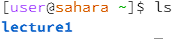
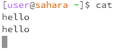
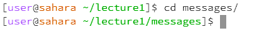
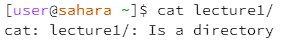
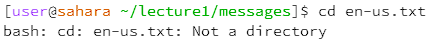
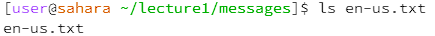
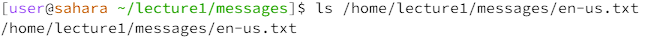
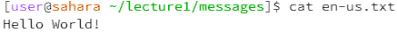

# Lab Report 1

1. Share an example of using the command with no arguments.
* An example of using the `cd` command with no arguments would be just using `cd`. Just using `cd` without any arguments changes the current directory to the home directory. In the screenshot below, I was currently in the `/home/lecture1` directory. upon using the command `cd`, I am returned to the home directory.  

* An example of using the command `ls` with no arguments would be just using `ls`. Doing so will print the contents of the working directory to the terminal. In this example, I am in the home directory, and when I run the command, "lecture1", which is a directory, is displayed to me.  
  
* An example of using `cat` with no arguments would just be using `cat`. This puts the terminal into standard input mode, where everything I type is echoed back to me. In this example, I am in the home directory, and I use the command. At first, the shell prompt disappears, and then I type *"hello"* and press **Enter**. `hello` is then printed back on the command line to me.  
  
2. Share an example of using the command with a path to a directory as an argument.
- An example of using the command `cd` with a path to a directory as an argument would be if my working directory is `/home/lecture1`, and I use `cd /messages`. Doing so will change the working directory to `/home/lecture1/messages`.  
  
* An example of using the command `ls` with a path to a directory as an argument would be if I am in the home directory, and I use `ls lecture1/`. Doing so will print out the contents of the `lecture1` directory, which in this case includes `Hello.class  Hello.java  messages  README`.  
 
* An example of using the command `cat` with a path to a directory as an argument would be if I am in the home directory, and I use `cat lecture1/`. Doing so will print out the error message `cat: lecture1/: Is a directory`. The reason this error message occurs is because cat, short for concatenate, prints out the text content of files. Since directories do not have a straightforward text representation like files, we cannot print them using `cat`.  
 
3. Share an example of using the command with a path to a file as an argument.
* An example of using the `cd` command with a path to a file as an argument would be if I am in the working directory `/home/lecture1/messages` and use the command `cd en-us.txt`. Doing so will produce an error message, which in this case is `bash: cd: en-us.txt: Not a directory`. This is because cd, or change directory, is meant for navigating through directories. As such, we cannot use it on a file, which is not a directory.  
 
* An example of using the `ls` command with a path to a file as an argument would be if I am in the working directory `/home/lecture1/messages` and use the command `ls en-us.txt`. Doing so will display the name of the file, which in this case is `en-us.txt`. Additionally, we can also pass in an absolute path of a file, such as with the command `ls /home/lecture1/messages/en-us.txt`. Doing so will display the absolute path of the file, which is `/home/lecture1/messages/en-us.txt` as seen in the picture. 

* An example of using the command `cat` with a path to a file as an argument would be if I am in the working directory `/home/lecture1/messages` and use the command `cat en-us.txt`. Doing so will print out the contents of the `en-us.txt` file, which in this case will be `Hello, World!`.  
 
