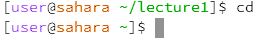

# Lab Report 1

1. Share an example of using the command with no arguments.
* An example of using the `cd` command with no arguments would be just using `cd`. Just using `cd` without any arguments changes the current directory to the home directory. In the screenshot below, I was currently in the `/lecture1` directory. upon using the command `cd`, I am returned to the home directory.

* An example of using the command `ls` with no arguments would be just using `ls`. Doing so will print the contents of the working directory to the terminal.
* An example of using `cat` with no arguments would just be using `cat`. This 
2. Share an example of using the command with a path to a directory as an argument.
- An example of using the command `cd` with a path to a directory as an argument would be if my working directory is `/lecture`, and I use `cd /messages`. Doing so will change the working directory to `/lecture/messages`.
* An example of using the command `ls` with a path to a directory as an argument would be if I am in the home directory, and I use `ls lecture1/`. Doing so will print out the contents of the `lecture1` directory, which in this case includes `Hello.class  Hello.java  messages  README`.
* An example of using the command `cat` with a path to a directory as an argument would be if I am in the home directory, and I use `cat lecture1/`. Doing so will print out `cat: lecture1/: Is a directory`. 
3. Share an example of using the command with a path to a file as an argument.
* An example of using the `cd` command with a path to a file as an argument 
* An example of using the `ls` command with a path to a file as an argument 
* An example of using the command `cat` with a path to a file as an argument would be if I am in the working directory `/lecture1/messages` and use the command `cat en-us.txt`. Doing so will print out the contents of the `en-us.txt` file, which in this case will be `Hello, World!`. 
