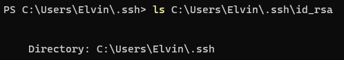

# Lab Report 2

1. Show the code for your `StringServer`, and two screenshots of using `/add-message`.
- This is the code for my `StringServer`, as well as `Server`, which is provided:  

- This is an example of me using `/add-message?s=Hello`:  

  - When I run `/add-message?s=Hello`, There are two main methods that are called. The first one is the "ServerHttpHandler.handle(HttpExchange exchange)" method located in `Server.java`, which is called whenever an HTTPS request is made to the server. The second one is "Handler.handleRequest(URI url)", which processes the request.
  - A relevant argument of the "ServerHttpHandler.handle(HttpExchange exchange)" method would be "exchange", which contains all the details of the HTTPS request, including headers, body, request method, and URI. A relevant argument of the "Handler.handleRequest(URI url)" method would be "url", which contains the path `/add-message?s=Hello`, including the query inside. A value of a relevant field would be `stringList`, which is an ArrayList. that stores strings. Without any requests, this would be an empty ArrayList. Another value of a relevant field would be `res`, which is a local variable used to accumulate a response. Depending on the content of `stringList`, it gets filled with strings in the format "1. Hello\n" after the processing. Another value of a relevant field is `decoded`, which is a local variable storing the decoded value of the parameter. Finally, there is `parameters`, a local array that splits the query part of the URL. 
  - stringList is modified after I make my request. Inside the Handler.handleRequest(URI url) method, the path `/add-message?s=Hello` contains the query parameter s with the value "Hello". After decoding, the string "Hello" is added to the stringList. As a result, stringList changes from an empty ArrayList to now containing one element: "Hello". The value of `res` changes based on the `stringList` contents. Given that "Hello" is added to `stringList`, `res` will have the value "1. Hello\n" at the end of the request processing. `parameters` will be created anew with every request. For this request, it will have the values: ["s", "Hello"] after URL decoding. `decoded` is a local variable and will store the value "Hello" after decoding the URL for this specific request. In the end, stringList will have ["Hello"].
- This is an example of me using `/add-message?s=How are you`:  

  - When I run `/add/message?s=How are you`, There are two main methods that are called. The first one is the "ServerHttpHandler.handle(HttpExchange exchange)" method located in `Server.java`, which is called whenever an HTTPS request is made to the server. The second one is "Handler.handleRequest(URI url)", which processes the request.
  - A relevant argument of the "ServerHttpHandler.handle(HttpExchange exchange)" method would be "exchange", which contains all the details of the HTTPS request, including headers, body, request method, and URI. A relevant argument of the "Handler.handleRequest(URI url)" method would be "url", which contains the path `/add-message?s=How are you`, including the query inside. A value of a relevant field would be `stringList`, which is an ArrayList. that stores strings. Since we added "Hello" previously, it would contain "Hello" before we run the request. Another value of a relevant field would be `res`, which is a local variable used to accumulate a response. Depending on the content of `stringList`, it gets filled with strings in the format "1. Hello\n" after the processing. Another value of a relevant field is `decoded`, which is a local variable storing the decoded value of the parameter. Finally, there is `parameters`, a local array that splits the query part of the URL.
  - stringList is modified after I make my request. Inside the Handler.handleRequest(URI url) method, the path `/add-message?s=How are you` contains the query parameter s with the value "How+are+you". After decoding, the string "How are you" is added to the stringList. As a result, stringList changes from just ["Hello"] to now being ["Hello", "How are you". The value of `res` changes based on the `stringList` contents. Given that "How are you" is added to `stringList`, `res` will have the value "1. Hello\n 2. How are you\n" at the end of the request processing. `parameters` will be created anew with every request. For this request, it will have the values: ["s", "How are you"] after URL decoding. `decoded` is a local variable and will store the value "How are you" after decoding the URL for this specific request. In the end, stringList will have ["Hello", "How are you"].
2. Using the command line, show with ls and take screenshots of:
- The path to the private key for your SSH key for logging into ieng6 (on your computer or on the home directory of the lab computer)  

  - Here, I am in the `C:\Users\Elvin\.ssh` directory, and I use the command `ls C:\Users\Elvin\.ssh\id_rsa`, the directory path `C:\Users\Elvin\.ssh` is displayed to me. I'm performinng this command on Windows PowerShell, so I assume that it doesn't display the file because of a Windows-specific feature. 
- The path to the public key for your SSH key for logging into ieng6 (within your account on ieng6)  

  - Here, I am in VS Code and logged into ieng6 on my account. I am in the directory `/home/linux/ieng6/cs15lfa23/cs15lfa23sa/.ssh`, and use the command `ls /home/linux/ieng6/cs15lfa23/cs15lfa23sa/.ssh/authorized_keys`. As a result, the path `/home/linux/ieng6/cs15lfa23/cs15lfa23sa/.ssh/authorized_keys` is displayed back to me. This appears to be different than my experience of displaying my private key, probably because I am in a linux environment now. 
- A terminal interaction where you log into ieng6 with your course-specific account without being asked for a password.  

  - Here, I am in VS Code without being logged into my ssh account. as I use the command `ssh cs15lfa23sa@ieng6.ucsd.edu`, I am able to login to my account without providing a password. This is because I now have the ssh key on my machine.
- In a couple of sentences, describe something you learned from lab in week 2 or 3 that you didn’t know before.
  - In this lab, I learned about ssh keys and how I can use them on my local machine to access into my ssh account without providing a password. This seems convenient since now I don't have to type my password in everytime I want to access my ssh account. Additionally, I learned more about constructing a java server, specifically on how to create routes and paths to perform specific tasks. 
