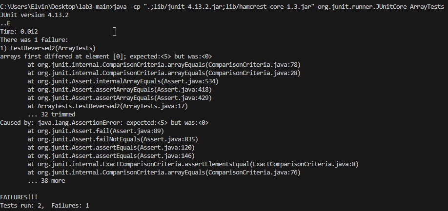

# Lab Report 3

## Part 1 - Bugs
Choose one of the bugs from week 4’s lab.

Provide:
- A failure-inducing input for the buggy program, as a JUnit test and any associated code (write it as a code block in Markdown)
```java
@Test
public void testReversed2() {
  int[] input1 = {1,2,3,4,5};
  assertArrayEquals(new int[]{5,4,3,2,1}, ArrayExamples.reversed(input1));
}
```
This is the test case that I created which produced an error for the ArrayExamples.reversed() method. The expected list should be {5,4,3,2,1}, but {0,0,0,0,0} was returned instead. 

- An input that doesn’t induce a failure, as a JUnit test and any associated code (write it as a code block in Markdown)
```java
 @Test
  public void testReversed() {
    int[] input1 = { };
    assertArrayEquals(new int[]{ }, ArrayExamples.reversed(input1));
  }
```
This is an input that doesn't induce a failure. It handles the case of an empty list. 
- The symptom, as the output of running the tests (provide it as a screenshot of running JUnit with at least the two inputs above)  
  
In the symptom, it can be seen that the failed test case has a 0 in the first index when the expected is 5. The empty case works as intended.
- The bug, as the before-and-after code change required to fix it (as two code blocks in Markdown)  
Before:
```java
  static int[] reversed(int[] arr) {
    int[] newArray = new int[arr.length];
    for(int i = 0; i < arr.length; i += 1) {
      arr[i] = newArray[arr.length - i - 1];
    }
    return arr;
  }
```
After:
```java
  static int[] reversed(int[] arr) {
    int[] newArray = new int[arr.length];
    for(int i = 0; i < arr.length; i += 1) {
      newArray[i] = arr[arr.length - i - 1];
    }
    return newArray;
  }
```
- Briefly describe why the fix addresses the issue.
The issue with the method was that instead of modifying the `newArray`, we were modifying the original `arr`. As a result, the method would always return a list of 0s since the elements that were being copied were values of 0 from the newly created empty array. To fix this, I simply changed the method to modify `newArray` so that it gets filled with elements from the original array. 

## Part 2 - Researching Commands
I am using the `find` command
1. `-type` option, which searches based on a specific type. 
  - Example 1) `find ./technical -type d`, which finds all directories within the directory `./technical`. This is useful if you want to filter out only the directories. 
      - Output:
      ```bash
      ./technical
      ./technical/911report
      ./technical/biomed
      ./technical/government
      ./technical/government/About_LSC
      ./technical/government/Alcohol_Problems
      ./technical/government/Env_Prot_Agen
      ./technical/government/Gen_Account_Office
      ./technical/government/Media
      ./technical/government/Post_Rate_Comm
      ./technical/plos
      ```
  - Example 2) `find ./technical -type f`, which finds all regular files within the directory `./technical`. This is useful if you want to filter out only the files. 
      - Output:
      ```bash
      ./technical/biomed/1471-2350-3-12.txt
      ./technical/biomed/1471-2350-3-7.txt
      ./technical/biomed/1471-2350-3-9.txt
      ./technical/biomed/1471-2350-4-2.txt
      ./technical/biomed/1471-2350-4-3.txt
      ./technical/biomed/1471-2350-4-4.txt
      ./technical/biomed/1471-2350-4-6.txt
      ./technical/biomed/1471-2369-3-1.txt
      ./technical/biomed/1471-2369-3-10.txt
      ...
      ```

2. `-size` option, which allows queries for file sizes. 
  - Example 1) `find ./technical -type f -size -2k`, which finds all regular files within the directory `./technical` that are less than 2 kilobytes. This can be helpful if you want to determine which files take up the least space.
      - Output:
      ```bash
      ./technical/plos/pmed.0020191.txt
      ./technical/plos/pmed.0020226.txt
      ```
  - Example 2) `find ./technical -type f -size +300k`, which finds all regular files within the directory `./technical` that are more than 300 kilobytes. This can be helpful if you want to determine which files take up the most space.
      - Output:
      ```bash
      ./technical/government/Gen_Account_Office/d01591sp.txt
      ./technical/government/Gen_Account_Office/Statements_Feb28-1997_volume.txt
      ```
3. `-mtime` option, which finds files modified within a certain time period by days.
  - Example 1) `find ./technical -type f -mtime -1`, which finds all files within the directory `./technical` that have been modified within the last day. This can be helpful if you want to track the most recent files modified.
      - Output:
      ```bash
      ./technical/biomed/1471-2350-3-12.txt
      ./technical/biomed/1471-2350-3-7.txt
      ./technical/biomed/1471-2350-3-9.txt
      ./technical/biomed/1471-2350-4-2.txt
      ./technical/biomed/1471-2350-4-3.txt
      ./technical/biomed/1471-2350-4-4.txt
      ./technical/biomed/1471-2350-4-6.txt
      ./technical/biomed/1471-2369-3-1.txt
      ...
      ```
  - Example 2) `find ./technical -type f -mtime +5`, which finds all files within the directory `./technical` that have been modified more than 5 days ago. This can be helpful if you want to track which files haven't been touched in a bit.
      - No output is produced because I haven't modified any files other than the initial download of them. 
4. `-delete` option, deletes files based on a given query.
  - Example 1) `find ./technical -type f -size +300k -delete`, which deletes all files more than 300 kilobytes. This can useful for removing files that are too large. 
      - Output: No output is produced becuase the option simply deletes the files. 
  - Example 2) `find ./technical -type f -mtime +30 -delete`, which deletes all files less than 2 kilobytes. This can be useful for removing files that might not have been utilized for a long time.
      - Output: No output is produced becuase the option simply deletes the files. 

Source: https://ss64.com/bash/find.html
