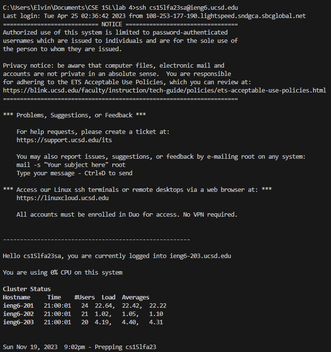
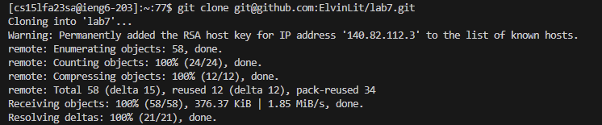
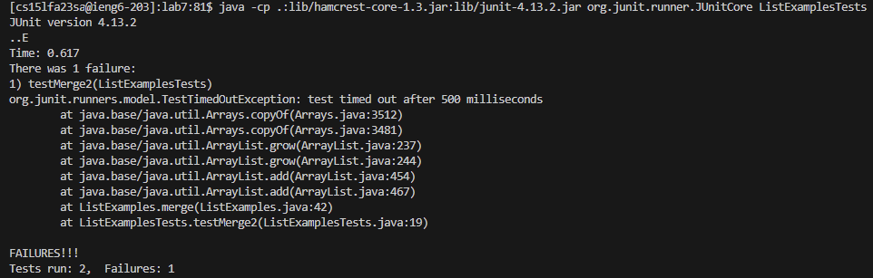
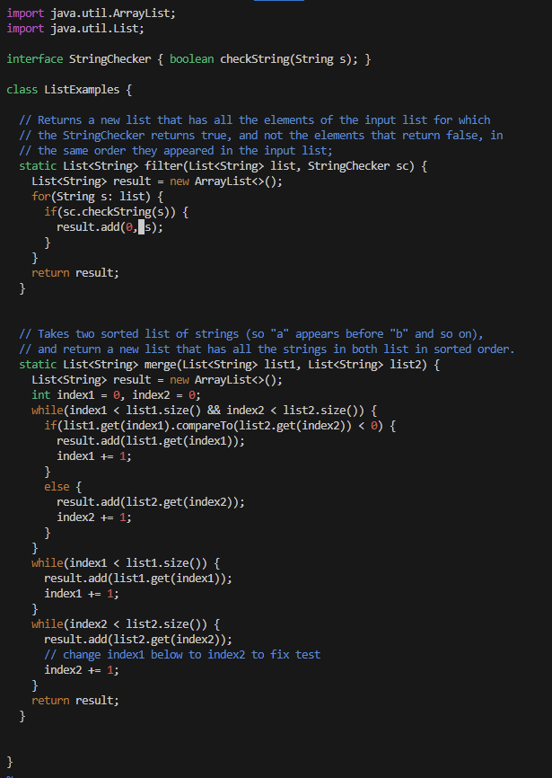
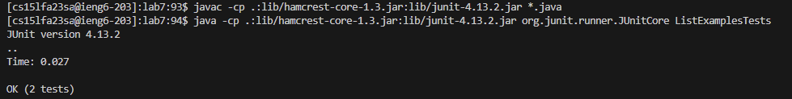
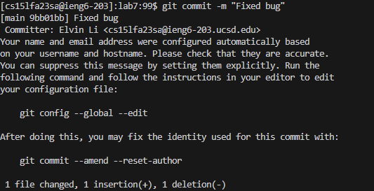
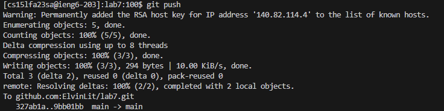

# Lab 4

## Step 4 - *Log into ieng6*  
To access ssh, I simply use the `ssh` command. No password is prompted.  
```
ssh cs15lfa23sa@ieng6.ucsd.edu <enter>
```


## Step 5 - *Clone your fork of the repository from your Github account (using the SSH URL)*  
To clone my fork of the repository, I navigated to my repository and copied the SSH URL. In my bash terminal, I used the `git clone` command as shown below.  
```
git clone git@github.com:ElvinLit/lab7.git <enter>
```


## Step 6 - *Run the tests, demonstrating that they fail*
To run the tests, I first navigate to my lab7 directory using `cd`, and then run a `javac` and `java` command to compile and run the tests. When I pressed tab after `cd lab`, `lab7/` is autofilled.  
```
cd lab <tab> <enter>
javac -cp .:lib/hamcrest-core-1.3.jar:lib/junit-4.13.2.jar *.java <enter>
java -cp .:lib/hamcrest-core-1.3.jar:lib/junit-4.13.2.jar org.junit.runner.JUnitCore ListExamplesTests <enter>
```


## Step 7 - *Edit the code file to fix the failing test*
To fix the failing test, I used vim to edit `ListExamples.java`. This is accessed when I typed "vim Lis", which is autofilled to "ListExamples", and I appended ".java". I then used the `?` command in vim to find the last instance of `index1`, so that I can change it to `index2`. I then write and exit.  
```
vim Lis <tab> .java <enter>
?index1<i>
<right><right><right><right><right><right><del><2>
<esc> :wq <enter>
```


## Step 8 - *Run the tests, demonstrating that they now succeed*  
To run the tests, I use a shortcut by utilizing the `Ctrl + R` feature in bash, which searches for previous commands. As such, this helped me use my previous commands I already ran in step 6.  
```
<Ctrl+R> javac <enter>
<Ctrl+R> java <enter>
```


## Step 9 - *Commit and push the resulting change to your Github account (you can pick any commit message!)*  
To commit and push my changes to GitHub, I add, commit with the message "Fixed bug", then push. 
```
git add ListExamples.java<enter>
git commit -m "Fixed bug"<enter>
git push <enter>
```



