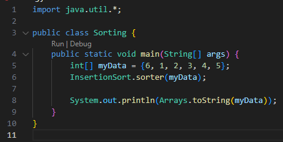
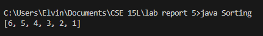
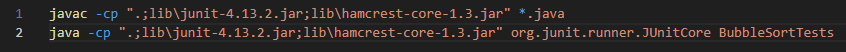
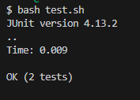

# Lab Report 5

## Part 1 – Debugging Scenario

**Student:** Hi CSE 15L TA, I am having trouble with some buggy code. I am currently attempting to implement insertion sort in java, but I am facing some issues in doing so. I have attached some screenshots for my code to show the issue.  
- Here is my implementation of insertion sort:  
    
- Here is my data that I attempted to sort:  
    
- And this is the output for when I sorted my data:  
    
- Here are my test cases that I created, ran with my bash script `test.sh`:  
  
- Here is my `test.sh` bash script, which I used to compile and run my tests:
  
- When I run the script, all my test cases seem to correctly succeed:
    

**Teaching Assistant:** 
