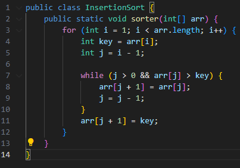
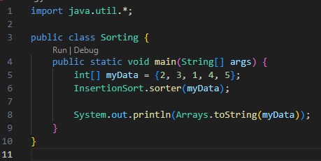
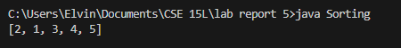

# Lab Report 5

## Part 1 – Debugging Scenario

1. The original post from a student with a screenshot showing a symptom and a description of a guess at the bug/some sense of what the failure-inducing input is. (Don’t actually make the post! Just write the content that would go in such a post)  
**Student:** Hi CSE 15L TA, I am having trouble with some buggy code. I am currently attempting to implement insertion sort in java, but I am facing some issues in doing so. I have attached some screenshots for my code to show the issue.  
- Here is my implementation of insertion sort:  
    
- Here is my data that I attempted to sort:  
    
- And this is the output for when I sorted my data:  
    
- Here are my test cases that I created, ran with my bash script `test.sh`:  
    
- Here is my `test.sh` bash script, which I used to compile and run my tests:  
    
- When I run the script, all my test cases seem to correctly succeed:  
    

2. A response from a TA asking a leading question or suggesting a command to try (To be clear, you are mimicking a TA here.)  
**Teaching Assistant:** Hello student. Let's start by reviewing the concept of Insertion Sort. Remember, the idea is to build a sorted array one element at a time. We take each element and insert it into its correct position relative to the already sorted part of the array. Focus on the while loop in your code. This loop is crucial as it determines where to insert the current element. Think about the conditions under which the loop stops. Ask yourself: What happens when the current element is smaller than the first element in the sorted part? Does the loop check the first element of the array? Why is this important? I recommend testing your algorithm with a few different arrays. For instance, try {3, 2, 1, 4, 5} and see what happens. Pay close attention to the position of the smallest element after sorting. Does it end up where you expect? If not, why might that be? Try to trace through your implementation, especially within the while loop, and note any edge cases that might appear.  

3. Another screenshot/terminal output showing what information the student got from trying that, and a clear description of what the bug is.  
The student managed to fix his implementation of insertion sort. Here is an overview of what he did:  
- First, he took the TA's advice and added a new test case, specifically {3, 2, 1, 4, 5}. Here are the changes to his testing file as well as the output:  
    
    
- After tracing through his code and paying attention to the smallest element after sorting, the student realized the mistake within his insertion sort implementation. The bug in his Insertion Sort algorithm lies in the while loop condition j > 0, which should be j >= 0. This incorrect condition causes the loop to skip comparisons with the first element of the array (at index 0). As a result, any element that should be placed before the first element in the sorted portion of the array will not be correctly positioned. This leads to only a partial sorting of the array, particularly affecting elements that need to be inserted at the beginning. The correct condition, j >= 0, ensures that each element is compared against all elements in the sorted portion, including the first element, thereby enabling the algorithm to sort the entire array accurately. As such, the student fixed his code as shown below:  
    
- Doing so, the test ran successfully and the student was able to sort correctly.  
    
    
4. At the end, all the information needed about the setup including: The file & directory structure needed, The contents of each file before fixing the bug, The full command line (or lines) you ran to trigger the bug, A description of what to edit to fix the bug.
- Directory Structure:
```
Lab Report 5/
|-- Lib/
|   |-- hamcrest-core-1.3.jar
|   `-- junit-4.13.2.jar
|-- InsertionSort.java
|-- InsertionSortTests.java
|-- Sorting.java 
`-- test.sh
```

- InsertionSort.java
```
public class InsertionSort {
    public static void sorter(int[] arr) {
        for (int i = 1; i < arr.length; i++) {
            int key = arr[i];
            int j = i - 1;

            
            while (j >= 0 && arr[j] > key) { 
                arr[j + 1] = arr[j];
                j = j - 1;
            }
            arr[j + 1] = key;
        }
    }
}
```

- InsertionSortTests.java
```
import org.junit.Test;
import static org.junit.Assert.*;

public class InsertionSortTests {
    @Test
    public void test1() {
        int[] actual = {5, 9, 6, 7, 8};
        int[] expected = {5, 6, 7, 8, 9};
        InsertionSort.sorter(actual);
        assertArrayEquals(expected, actual);
    }

    @Test
    public void test2() {
        int[] actual = {1, 3, 2, 4, 5};
        int[] expected = {1, 2, 3, 4, 5};
        InsertionSort.sorter(actual);
        assertArrayEquals(expected, actual);
    }

    @Test
    public void test3() {
        int[] actual = {3, 2, 1, 4, 5};
        int[] expected = {1, 2, 3, 4, 5};
        InsertionSort.sorter(actual);
        assertArrayEquals(expected, actual);
    }
}
```

- Sorting.java
```
import java.util.*;

public class Sorting {
    public static void main(String[] args) {
        int[] myData = {2, 3, 1, 4, 5};
        InsertionSort.sorter(myData);

        System.out.println(Arrays.toString(myData));
    }
}
```

- test.sh
```
javac -cp ".;lib\junit-4.13.2.jar;lib\hamcrest-core-1.3.jar" *.java
java -cp ".;lib\junit-4.13.2.jar;lib\hamcrest-core-1.3.jar" org.junit.runner.JUnitCore InsertionSortTests
```
