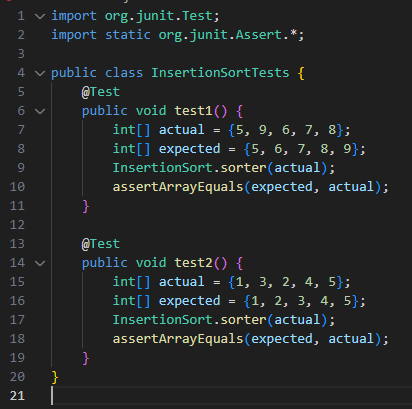

# Lab Report 5

## Part 1 – Debugging Scenario

**Student:** Hi CSE 15L TA, I am having trouble with some buggy code. I am currently attempting to implement insertion sort in java, but I am facing some issues in doing so. I have attached some screenshots for my code to show the issue.  
- Here is my implementation of insertion sort:  
    
- Here is my data that I attempted to sort:  
    
- And this is the output for when I sorted my data:  
    
- Here are my test cases that I created, ran with my bash script `test.sh`:  
  
- Here is my `test.sh` bash script, which I used to compile and run my tests:
  
- When I run the script, all my test cases seem to correctly succeed:  
    

**Teaching Assistant:** Hello student. Let's start by reviewing the concept of Insertion Sort. Remember, the idea is to build a sorted array one element at a time. We take each element and insert it into its correct position relative to the already sorted part of the array. Focus on the while loop in your code. This loop is crucial as it determines where to insert the current element. Think about the conditions under which the loop stops. Ask yourself: What happens when the current element is smaller than the first element in the sorted part? Does the loop check the first element of the array? Why is this important? I recommend testing your algorithm with a few different arrays. For instance, try {2, 3, 1, 4, 5} and see what happens. Pay close attention to the position of the smallest element after sorting. Does it end up where you expect? If not, why might that be?
